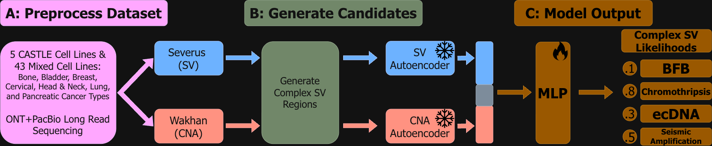
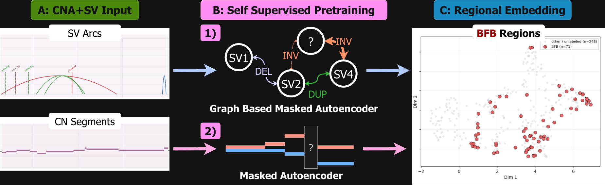

# complex-SV

> **Status:** This tool is still in progress. Only 48 cell lines were used for training, and we hope to expand this set and the tool's capabilities to short read callers soon. Please reach out to bds062@umd.edu for any questions, comments, or concerns.

A research pipeline for detecting complex structural-variant events from
[Wakhan](https://github.com/KolmogorovLab/Wakhan) copy-number alterations and
[Severus](https://github.com/KolmogorovLab/Severus) structural-variant calls.

The repository supports two related tasks:

- **localized event detection**: propose genomic intervals, classify them as
  BFB, chromothripsis, ecDNA, or seismic amplification, and return calibrated
  event boundaries;
- **chromosome-level detection**: predict which of the four event classes occur
  anywhere on each chromosome. This model is multilabel and does not localize
  an event.

The numbered scripts in [`scripts/`](scripts/) are the supported model entry
points. The upstream [label generator](label_generator/README.md),
[candidate generator](candidate_generator/README.md), and replaceable
[integration-test configuration](test/README.md) are documented separately.
Held-out predictions, aggregate metrics, labels, and primary figures are
provided in [`benchmarks/`](benchmarks/).

[View the project poster (PDF)](Complex_SV_Poster_2026.pdf)

## Method overview



*The complete method, from Wakhan and Severus outputs through frozen
featurization and the localized or chromosome-level prediction heads.*

The frozen encoders generate a 402-dimensional base representation: 256 CN
features, 64 regional SV features, 64 global SV features, and 18 segment
statistics. The final heads receive 1,254 inputs after adding local/context
features, coordinates, 37 safe tabular summaries, and three proposal-prior
slots. The chromosome model sets the proposal slots to zero.

The selected localization evaluation reached precision 0.325, recall 0.491,
F1 0.391, and F2 0.445 at overlap coefficient >= 0.5. The chromosome model
reached precision 0.320, recall 0.545, F1 0.403, and F2 0.478. Detailed labels,
out-of-fold predictions, metrics, and figures are provided under:

- [localization benchmark](benchmarks/localization/README.md)
- [chromosome benchmark](benchmarks/chromosome/README.md)
- [chromosome-level ensemble](benchmarks/ensemble/README.md)

## 1. Installation

The recommended installation uses the supplied Conda environment, which is a
superset of the KolmogorovLab/Severus environment:

```bash
git clone git@github.com:srinivasabd/complex-SV.git
cd complex-SV

conda env create --file environment.yml
conda activate complex-SV
python scripts/00_check_install.py
```

All runtime and training dependencies, including PyTorch and PyTorch
Geometric, are installed by Conda from `conda-forge`/`bioconda`; there is no
secondary pip installation phase.

The same environment can be reused for Severus and complex-SV:

```bash
conda env update --name severus_env --file environment.yml
conda activate severus_env
python scripts/00_check_install.py
severus --help
```

Do not use `--prune` when updating an existing Severus environment. A separate
`complex-SV` environment remains preferable for reproducibility because it
isolates the PyTorch stack from a validated caller installation.

The portable environment selects a CPU PyTorch build when CUDA is not visible
to Conda. To use a GPU, run the following on a GPU node after creating the
environment:

```bash
conda install --name complex-SV --channel conda-forge "pytorch-gpu>=2.1,<3"
```

Then confirm the installed build with:

```bash
python -c "import torch; print(torch.version.cuda, torch.cuda.is_available())"
```

When an HPC login node hides the GPU driver, either run the installation in an
interactive GPU allocation or set `CONDA_OVERRIDE_CUDA` to the CUDA version
supported by the cluster driver before the `conda install` command.

The project is currently designed for GRCh38. Candidate generation uses the
bundled [centromere coordinates](genomic_features/grch38.cen_coord.curated.bed).

## 2. Input files

Every downstream command uses a tab-separated manifest with one row per genome:

```tsv
sample_id	wakhan_root	severus_vcf
sample_A	/absolute/path/sample_A	/absolute/path/sample_A.severus.vcf
sample_B	/absolute/path/sample_B	/absolute/path/sample_B.severus.vcf
```

`wakhan_root` may be a Wakhan BED root, a
`*_copynumbers_segments` prefix, or either member of the paired
`*_copynumbers_segments_HP_1.bed` and `HP_2.bed` files. `severus_vcf`
must point to the Severus VCF for the same genome. Sample identifiers must be
unique and consistent with the training-label tables.

The original 48-genome manifest \(5 CASTLE and 43 New Cell Line)and a utility for appending new
samples are provided in [`manifest/`](manifest/README.md). The utility selects
the Wakhan solution with the largest third score component and validates all
required files before updating a manifest.

Use absolute paths in manifests and pretraining lists. It makes Slurm jobs
independent of their launch directory.

## Quick start: apply the all-48 models

The release includes one final-fit localization model and one final-fit
chromosome model trained with all 48 genomes. Apply both to a new
manifest with one command:

```bash
scripts/12_predict_new_dataset.sh \
  inputs/new_manifest.tsv \
  outputs/new_dataset \
  cuda
```

This generates candidates, builds frozen CN/SV features, and writes:

- `localized_calls/localized_complex_sv.tsv`: classified genomic intervals;
- `chromosome_calls/chromosome_predictions.tsv`: probabilities for every
  chromosome and class;
- `chromosome_calls/predicted_complex_sv.tsv`: thresholded chromosome calls.

Set `CANDIDATE_PROFILE=sensitive` for recall-oriented proposal generation and
set `PYTHON_BIN` if the environment interpreter is not named `python`. The
final-fit checkpoints use all available training genomes and therefore have no
held-out performance estimate of their own; use the genome-held-out results in
`benchmarks/` when reporting expected generalization.

## Apply the localization model to one genome

The shipped localization checkpoint can be applied directly to one new genome.
It uses the same two signal sources as training: a Wakhan copy-number BED root
and the matching Severus VCF. The BED argument may be a
`*_copynumbers_segments` prefix or either `*_HP_1.bed`/`*_HP_2.bed` member;
the companion haplotype BED is resolved automatically.

```bash
python scripts/13_predict_localization_single.py \
  --sample-name SAMPLE_A \
  --bed-root /absolute/path/SAMPLE_A_copynumbers_segments \
  --severus-vcf /absolute/path/SAMPLE_A.severus.vcf \
  --output-dir outputs/SAMPLE_A_localization \
  --device auto
```

`--bed-root`, `--wakhan-root`, and `--wakhan-file` are aliases for the same
Wakhan input. By default, the command uses the final localization model fit on
all 48 training genomes and the balanced candidate profile. Add
`--profile sensitive` for the recall-oriented candidate generator, or
`--checkpoint /path/to/model.pt` to use another compatible final-fit model.

The command generates candidates, embeds them with the shipped frozen
featurizers, applies the calibrated localizer/decoder, and writes:

```text
outputs/SAMPLE_A_localization/
├── predictions.tsv
├── plots/
│   ├── BFB/*.png
│   ├── chromothripsis/*.png
│   ├── ecDNA/*.png
│   ├── seismic_amplification/*.png
│   └── selected_predictions.tsv
├── input_manifest.tsv
├── run_summary.json
├── candidates/
├── features/
└── localized_calls/
```

`predictions.tsv` has one row per final localized class call. Its main fields
are:

| Field | Meaning |
|---|---|
| `prediction_id` | Stable identifier for the call in this run |
| `sample_name` | CLI sample name |
| `chromosome`, `chromosome_arm` | Predicted chromosome and arm; arm is blank when the full chromosome is shown |
| `region`, `start`, `end` | Predicted interval as `chrom:start-end`; coordinates are zero-based with an inclusive end |
| `prediction` | Predicted broad class: BFB, chromothripsis, ecDNA, or seismic amplification |
| `score`, `threshold`, `score_margin` | Model score, calibrated class threshold, and their difference |
| `plot_status`, `plot_path` | Plot result and path relative to the run output directory |
| `original_start`, `original_end`, `boundary_scale` | Proposal interval before final boundary calibration and the applied scale |
| `cluster_id`, `cluster_size`, `region_mode`, `nms_mode` | Candidate-cluster and decoder provenance |

Every row in `predictions.tsv` receives a PNG under `plots/<prediction>/`.
Each plot spans the entire chromosome arm containing the call; a call crossing
the centromere, or one without a resolvable arm, is shown across the entire
chromosome. The blue outline marks only the localized `start`-to-`end`
interval. The three tracks show Severus SV arcs, Wakhan haplotype copy number,
and breakpoint evidence. `plots/selected_predictions.tsv` is the plot index.
If no call passes the calibrated decoder, `predictions.tsv` is a valid
header-only table and no prediction PNGs are produced.

## 3. Pretrain the autoencoders



*The copy-number and breakpoint-graph pretraining objectives and their use in
constructing fixed-dimensional candidate-region embeddings.*


You can skip this section and use the checkpoints shipped in
[`models/pretrained_featurizer/`](models/pretrained_featurizer/).

### 3.1 Copy-number masked autoencoder

Create a text file containing one Wakhan root per line:

```text
/absolute/path/sample_A
/absolute/path/sample_B
```

Then run:

```bash
scripts/01_pretrain_cn_encoder.sh \
  inputs/wakhan_roots.txt \
  outputs/pretraining/cn \
  --epochs 100 \
  --batch_size 64
```

The trainer samples fixed-base-pair windows, resamples paired haplotype copy
number into fixed-length tensors, masks bins, and minimizes reconstruction MSE
only over masked bins. Its primary artifact is
`outputs/pretraining/cn/cn_encoder.pt`; metadata, logs, a loss plot, and
optional window embeddings are written beside it.

### 3.2 Severus graph masked autoencoder

Create a text file containing one Severus VCF per line:

```text
/absolute/path/sample_A.severus.vcf
/absolute/path/sample_B.severus.vcf
```

Then run:

```bash
scripts/02_pretrain_sv_encoder.sh \
  inputs/severus_vcfs.txt \
  outputs/pretraining/sv \
  --epochs 100 \
  --batch_size 32
```

The graph trainer builds regional breakpoint graphs, masks SV nodes, and
optimizes node reconstruction plus graph-level density, foldback, and
interchromosomal objectives. Its primary artifact is
`outputs/pretraining/sv/graph_encoder.pt`.

Run either numbered command with `--help` after its two positional arguments
to inspect advanced window, masking, architecture, and sampling settings. A
newly pretrained checkpoint can replace the default path in the embedding
commands by passing a later duplicate `--cn_checkpoint` or
`--graph_checkpoint` argument.

## 4. Use the final-fit localization model

This path returns semi-localized event intervals.

### 4.1 Generate label-free proposals

```bash
candidate_generator/run.sh \
  inputs/manifest.tsv \
  outputs/localized/candidates \
  --profile balanced \
  --keep_going
```

The generator combines short-segment runs, focal high-copy runs, Severus
foldbacks, multiscale SV clusters, joint CNA/SV windows, and complex chromosome
arms. It does not read class labels or external complex-SV callers. The selected
table is `merged_candidate_regions.csv`; the sensitive and balanced tables are
also retained.

Use `--profile sensitive` when proposal recall is more important than runtime
and false-positive burden.

### 4.2 Embed candidates

```bash
scripts/04_embed_candidates.sh \
  inputs/manifest.tsv \
  outputs/localized/candidates/merged_candidate_regions.csv \
  outputs/localized/features \
  --device cuda
```

This writes candidate metadata, the 402-dimensional encoder bundle, the
1,214-dimensional selected local/context representation, and the 37 safe
tabular features.

### 4.3 Apply the all-48 checkpoint

```bash
python scripts/10_predict_localization.py \
  --candidates outputs/localized/candidates/merged_candidate_regions.csv \
  --embedding-bundle outputs/localized/features/embeddings.npz \
  --selected-embeddings outputs/localized/features/selected_embedding_features.npz \
  --tabular-features outputs/localized/features/tabular_features.npz \
  --output outputs/localized/predictions \
  --device cuda
```

`localized_complex_sv.tsv` contains the semi-localized event calls and
`candidate_scores.tsv` preserves every class score for auditing. The default
checkpoint in `models/localization_all48/` was trained from
initialization on all 48 cohort genomes for 34 fixed epochs. The epoch count is
the median best epoch from 37 genome-held-out fits. Decoder thresholds and
geometry settings are per-class medians or modes of choices made on each fold's
folds inner-validation genomes; outer held-out labels selected no deployment
parameter. The 108 training labels occur in 37 genomes. This is the deployment
model, while the held-out benchmark remains the generalization estimate. Script
06 remains available for reproducing the LOO vote ensemble.

## 5. Train the localization model

Training labels are tab-separated and use inclusive interval ends:

```tsv
region_id	sample_id	chrom	start	end	label
event_001	sample_A	chr8	127000000	133000000	ecDNA
```

Allowed labels are `ecDNA`, `chromothripsis`, `BFB`, and
`seismic_amplification`.

### 5.1 Genome-held-out training

First run candidate generation and feature extraction for the full training
cohort. Then reproduce the selected event-bag MIL and frozen-decoder
cross-validation:

```bash
scripts/05_train_localization_model.sh \
  outputs/train/candidates/merged_candidate_regions.csv \
  inputs/training_labels.tsv \
  outputs/train/features/embeddings.npz \
  outputs/train/features/selected_embedding_features.npz \
  outputs/train/features/tabular_features.npz \
  AU565 \
  outputs/train/localization_cv/AU565
```

Run step 05 once for every labeled genome, using that genome as
`TEST_SAMPLE`. These independent jobs can be launched as a Slurm array. Each
run trains its own scorer, selects validation genomes by event counts, and
calibrates its frozen event-cluster decoder without the test genome.

For every caller event, all overlapping proposals form a bag. Candidates with
overlap coefficient >= 0.5 receive direct class supervision; partial overlaps
receive continuous overlap-quality supervision. Hard-negative mining reduces
damage from incomplete labels. Validation genomes select early stopping,
class-specific thresholds, representative-versus-envelope geometry, centered
boundary scale, containment NMS mode, and per-genome output caps. Test genomes never participate in fitting or
calibration.

Each run writes held-out predictions and matches, training history, decoder
calibration and sweep tables, split membership, metrics, and one checkpoint.
Aggregate only after all labeled test genomes finish. Split strictly by genome.

### 5.2 Fit the all-genome deployment checkpoint

After every held-out run completes, fit one deployment model without reusing
training labels for early stopping or decoder calibration:

```bash
python scripts/train_localization_all.py \
  --candidates outputs/train/candidates/merged_candidate_regions.csv \
  --labels inputs/training_labels.tsv \
  --embedding-bundle outputs/train/features/embeddings.npz \
  --selected-embeddings outputs/train/features/selected_embedding_features.npz \
  --tabular-features outputs/train/features/tabular_features.npz \
  --cv-runs outputs/train/localization_cv \
  --output outputs/train/localization_all
```

Each CV-run directory must contain `training_history.tsv` and
`event_decoder_calibration.tsv`. The script fixes training duration to the
median held-out-fold best epoch, aggregates only inner-validation-selected
decoder settings, and then trains from initialization using all genomes.

## 6. Use the final-fit chromosome model

This path predicts classes per chromosome and intentionally skips proposal
generation, localization, geometry adjustment, and NMS.

### 6.1 Prepare one representation per chromosome

```bash
scripts/07_embed_chromosomes.sh \
  inputs/manifest.tsv \
  outputs/chromosome
```

### 6.2 Apply the all-48 checkpoint

```bash
python scripts/11_predict_chromosomes.py \
  --embedding-dir outputs/chromosome/embeddings \
  --tabular outputs/chromosome/chromosome_tabular.tsv \
  --output outputs/chromosome/predictions \
  --device cuda
```

The output is multilabel: one chromosome may receive multiple classes.
`chromosome_predictions.tsv` contains all chromosome-class probabilities and
thresholds; `predicted_complex_sv.tsv` contains thresholded calls. The final
head was fit on all 48 genomes for 38 epochs, the median best epoch from the
five held-out folds. Its per-class thresholds are medians of the five
validation-selected F2 thresholds rather than thresholds fitted to its own
training predictions. Script 09 remains available for reproducing the
five-fold vote ensemble.

## 7. Train the chromosome model

After step 07, provide a label table with columns `sample_id`, `chrom`, and
`label`. Run one independent job per labeled test genome:

```bash
scripts/08_train_chromosome_model.sh \
  outputs/chromosome/embeddings \
  outputs/chromosome/chromosome_tabular.tsv \
  inputs/chromosome_labels.tsv \
  AU565 \
  outputs/chromosome_cv/AU565
```

The model uses weighted multilabel BCE. Observed positives receive weight 1.0,
missing classes on another labeled chromosome receive weight 0.25, and fully
unlabeled chromosomes receive weight 0.10. Per-class F2 thresholds are selected
on validation genomes. Split by genome: chromosomes from a test genome must
never occur in training or calibration. The independent LOO jobs can be
launched as a Slurm array.

## 8. Repository layout

The `genomic_features/` and `architectures/` packages implement the core
method. `genomic_features/` parses caller output, constructs genomic features,
and applies the frozen featurizers to candidate regions and chromosomes.
`architectures/` defines the supervised prediction heads and event decoder.

```text
benchmarks/     labels, held-out predictions, metrics, and primary figures
candidate_generator/ label-free Wakhan/Severus proposal pipeline
configs/        versioned method configuration
genomic_features/ Wakhan/Severus parsing and genomic feature construction
docs/figures/   publication diagrams embedded in the documentation
label_generator/ curated caller TSV normalization and provenance
manifest/       publication cohort manifest and sample-discovery updater
architectures/  localization, event-decoder, and chromosome architectures
models/         frozen featurizers, final-fit models, and evaluation ensembles
pretrain/       masked-autoencoder implementations and trainers
test/           configurable single-genome integration tests
training/       candidate feature preparation and shared loss functions
scripts/       supported numbered training and inference commands
```
