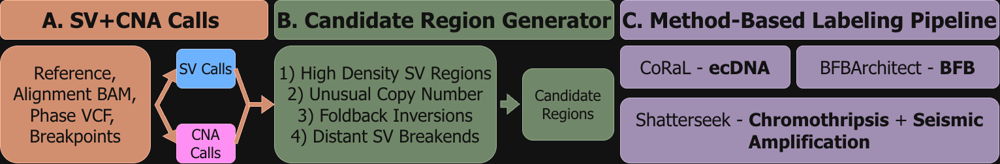

# Candidate generation

Label-free proposal stage for localized complex-SV
detection. It consumes Wakhan copy-number output and Severus structural-variant
calls to identify candidate complex regions.



*Candidate proposals are generated from copy-number and SV evidence. During
training, proposals are associated with curated event labels by genomic
overlap; labels are not used when generating candidates for a new genome.*

## Input manifest

The tab-separated manifest contains one genome per row:

```tsv
sample_id	wakhan_root	severus_vcf
sample_A	/absolute/path/sample_A	/absolute/path/sample_A.severus.vcf
```

`wakhan_root` is the prefix associated with the paired haplotype BEDs and the
Wakhan integer-CNA VCF.

## Run

```bash
candidate_generator/run.sh \
  inputs/manifest.tsv \
  outputs/candidates \
  --profile balanced \
  --keep_going
```

Use `--profile sensitive` for maximum proposal recall. Both the sensitive and
balanced tables are written irrespective of the selected profile.

## Proposal families

The generator unions six class-agnostic evidence sources:

1. runs of short copy-number segments;
2. focal high-copy runs relative to sample ploidy;
3. foldback inversion intervals and nearby foldback groups;
4. adaptive multiscale Severus breakpoint clusters;
5. joint copy-number/SV density windows;
6. unusually complex chromosome arms.

Highly redundant intervals are merged, expanded to observed CNA boundaries,
annotated with CNA/SV summaries, and evidence-ranked. The balanced profile
removes weak isolated proposals; this is a proposal-recall/runtime control and
not the localization model's classification threshold.

## Outputs

- `merged_candidate_regions.csv`: candidates selected by the requested profile;
- `merged_candidate_regions_sensitive.csv`: all retained proposals;
- `merged_candidate_regions_balanced.csv`: evidence-filtered subset;
- `candidate_regions/`: per-genome selected and sensitive tables;
- `candidate_generator_summary.json`: parameters and proposal counts;
- `failed_samples.csv`: present only with failures under `--keep_going`.

The coordinates are consumed directly by `scripts/04_embed_candidates.sh`.
All defaults are versioned in `generate_candidates.py`; advanced values are
listed by `python candidate_generator/generate_candidates.py --help`.
